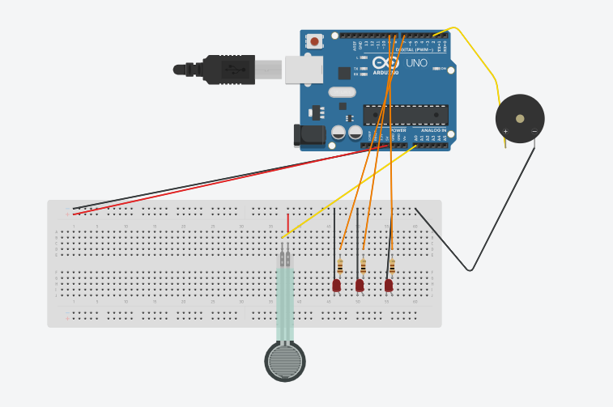

# Smart-coaster-
Hello! this is my smart coaster project! this is a project for week one of hack club's halflife. The goal of my smart coaster is to help people who have trouble remember to drink water, to stay hydrated. I would also like to preface the rest of this readme by saying that I have no idea what I'm doing, and this is like pretty much the first time I am using GitHub without major help. 
### What the smart coaster does-
there is pressure sensor that you place your cup on and when it senses that your cup has been on the pressure sensor too long, the little creature on the screen gets a bit more mad. as you leave your cup on the pressure sensor longer, the creature will get progressively more and more mad until it gets super mad and flashes lights and sets off a buzzer until you pick up your cup to take a sip. 
### My goal with the smart coaster- 
my goal with the smart coaster is to not only help people stay hydrated but to also learn more about PCB and the different pieces and pins of microcontroller myself
### Author
Me! EveyKay: https://github.com/EveyKay
### Files 
- BOM [`BOM.md`](BOM.md)
- PBC, Work in progress
- Final Code, Work in Progress

## History
### Tinkercad Prototype 
Im am not that good at electronics ... Yet. so because of my lack of experience I decided to make a digital prototype through tinkercad so I could mess around with pins on the micro controller and  practice coding. here is a picture of v1 of the smart coaster and the code I make in tinker cad, neither of these will be used in the final version. 

```py
// C++ code
//
#include <Adafruit_LiquidCrystal.h>

int ok = 0;

Adafruit_LiquidCrystal lcd_2(2);

void setup()
{
  pinMode(LED_BUILTIN, OUTPUT);
  pinMode(A0, INPUT);
  Serial.begin(9600);
  lcd_2.begin(16, 2);
  pinMode(9, OUTPUT);
  pinMode(8, OUTPUT);
  pinMode(7, OUTPUT);
  pinMode(2, OUTPUT);
}

void loop()
{
  digitalWrite(LED_BUILTIN, HIGH);
  delay(1000); // Wait for 1000 millisecond(s)
  digitalWrite(LED_BUILTIN, LOW);
  delay(1000); // Wait for 1000 millisecond(s)

  if (analogRead(A0) < 1017) {
    Serial.println("Good job!");
  }

  if (analogRead(A0) > 1017) {
    delay(1000); // Wait for 1000 millisecond(s)
    Serial.println("water?");
    lcd_2.print("Water?");
    delay(1000); // Wait for 1000 millisecond(s)
    Serial.println("Water!");
    lcd_2.print("Water!");
    delay(1000); // Wait for 1000 millisecond(s)
    Serial.println("WATERRRR!");
    lcd_2.print("WATEERRRRR!!!!");
    while (analogRead(A0) > 1017) {
      digitalWrite(9, HIGH);
      digitalWrite(8, HIGH);
      digitalWrite(7, HIGH);
      digitalWrite(2, HIGH);
      delay(100); // Wait for 100 millisecond(s)
      digitalWrite(9, LOW);
      digitalWrite(8, LOW)
      ;digitalWrite(7, LOW);
      digitalWrite(2, LOW);
      delay(100); // Wait for 100 millisecond(s)
      digitalWrite(9, HIGH);
      digitalWrite(8, HIGH);
      digitalWrite(7, HIGH);
      digitalWrite(2, HIGH);
      delay(100); // Wait for 100 millisecond(s)
      digitalWrite(9, LOW);
      digitalWrite(8, LOW);
      digitalWrite(7, LOW);
      digitalWrite(2, LOW);
    }
  }
}
```
